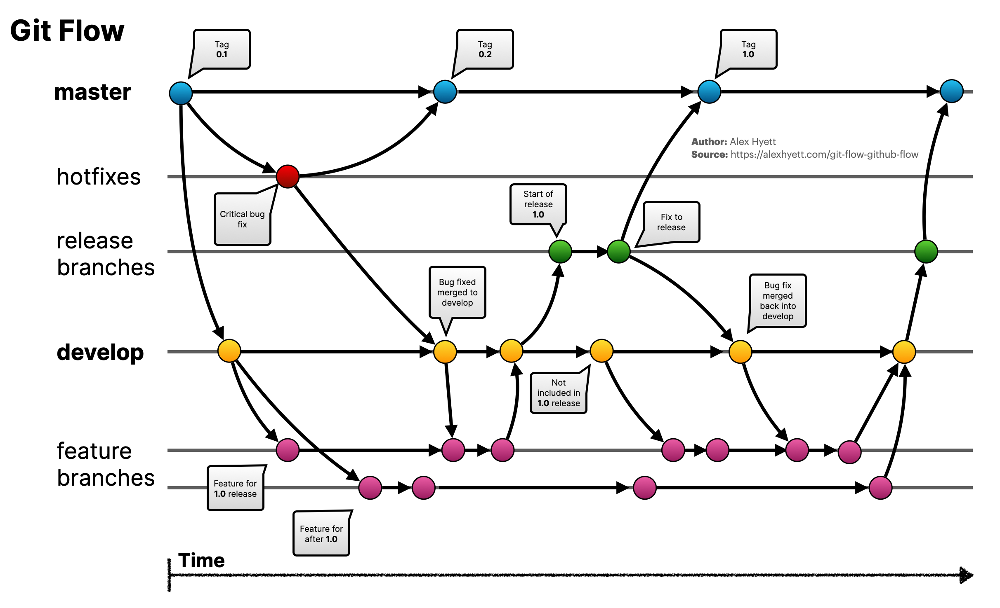
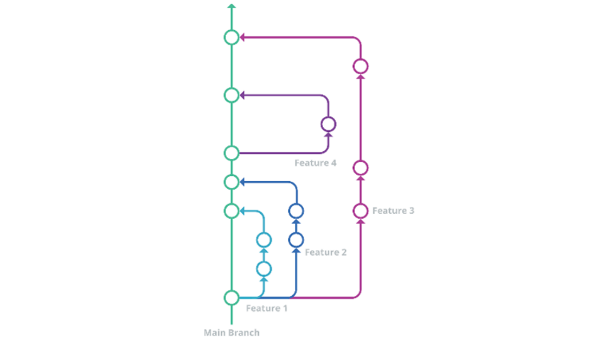
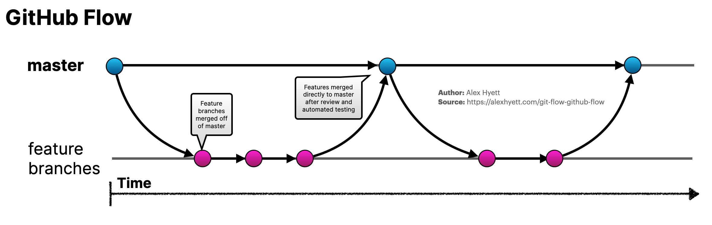
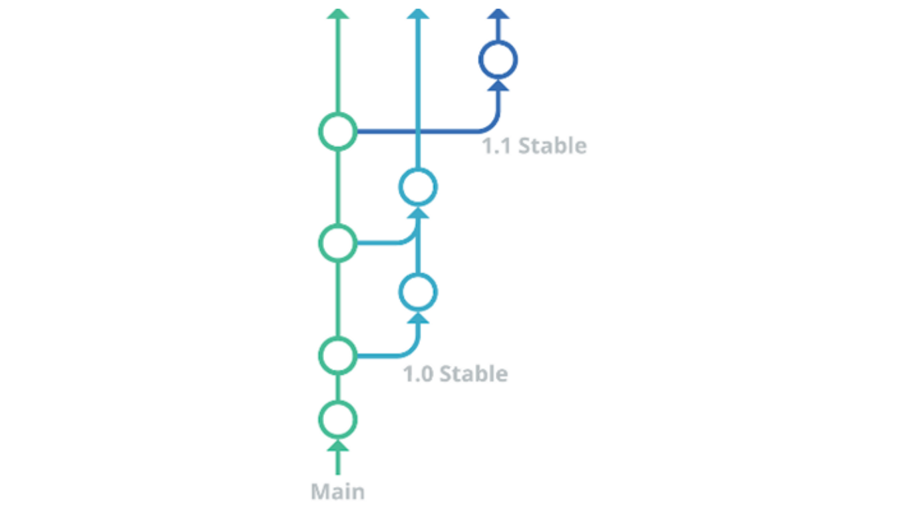

# Comparaison des Workflows Git : Gitflow vs GitHub Flow vs GitLab Flow

## Table des matières

- [Comparaison des Workflows Git : Gitflow vs GitHub Flow vs GitLab Flow](#comparaison-des-workflows-git--gitflow-vs-github-flow-vs-gitlab-flow)
  - [Table des matières](#table-des-matières)
  - [Introduction](#introduction)
  - [Gitflow](#gitflow)
    - [Principes et structure de Gitflow](#principes-et-structure-de-gitflow)
    - [Fonctionnement de Gitflow](#fonctionnement-de-gitflow)
    - [Avantages et inconvénients de Gitflow](#avantages-et-inconvénients-de-gitflow)
  - [GitHub Flow](#github-flow)
    - [Principes et structure de GitHub Flow](#principes-et-structure-de-github-flow)
    - [Fonctionnement de GitHub Flow](#fonctionnement-de-github-flow)
    - [Avantages et inconvénients de GitHub Flow](#avantages-et-inconvénients-de-github-flow)
  - [GitLab Flow](#gitlab-flow)
    - [Principes et structure de GitLab Flow](#principes-et-structure-de-gitlab-flow)
    - [Fonctionnement de GitLab Flow](#fonctionnement-de-gitlab-flow)
    - [Avantages et inconvénients de GitLab Flow](#avantages-et-inconvénients-de-gitlab-flow)
  - [Tableau comparatif](#tableau-comparatif)
  - [Quel workflow choisir ?](#quel-workflow-choisir-)
    - [Choisissez Gitflow si :](#choisissez-gitflow-si-)
    - [Choisissez GitHub Flow si :](#choisissez-github-flow-si-)
    - [Choisissez GitLab Flow si :](#choisissez-gitlab-flow-si-)
  - [Conclusion](#conclusion)

## Introduction

La gestion des branches Git est un élément fondamental dans le développement logiciel moderne. Elle permet aux équipes de travailler en parallèle sur différentes fonctionnalités, de gérer les versions et de maintenir un code stable en production. Plusieurs workflows Git ont émergé au fil du temps pour répondre à différents besoins et contextes de développement.

Ce document présente une comparaison détaillée de trois workflows Git populaires : Gitflow, GitHub Flow et GitLab Flow. Chacun de ces workflows propose une approche différente pour organiser les branches et gérer le cycle de vie du développement logiciel. Nous analyserons leurs principes, leur fonctionnement, ainsi que leurs avantages et inconvénients respectifs.

L'objectif est de fournir une vue d'ensemble claire pour aider les équipes à choisir le workflow le plus adapté à leurs besoins spécifiques, en fonction de la taille de l'équipe, de la complexité du projet, et de la fréquence des déploiements.


## Gitflow

### Principes et structure de Gitflow

Gitflow est un modèle de gestion de branches Git créé par Vincent Driessen en 2010. Il s'agit d'un workflow relativement complexe qui définit un ensemble strict de règles pour la création et la fusion des branches. Gitflow est particulièrement adapté aux projets avec des cycles de release planifiés et prévisibles.

La structure de Gitflow repose sur deux branches principales à durée de vie infinie :

- **master** : Contient uniquement le code de production stable. Chaque commit sur cette branche représente une nouvelle version en production.
- **develop** : Sert de branche d'intégration pour les fonctionnalités en cours de développement. Cette branche contient toujours les dernières fonctionnalités développées.

En plus de ces branches principales, Gitflow utilise plusieurs types de branches temporaires :

- **feature/*** : Pour développer de nouvelles fonctionnalités
- **release/*** : Pour préparer une nouvelle version de production
- **hotfix/*** : Pour corriger rapidement des bugs critiques en production

Voici un schéma représentant la structure de Gitflow :

```
                            ┌─────────────────────────────────────────────────────────────────────┐
                            │                                                                     │
                            │                                                                     │
                            │                                                                     ▼
┌───────────┐     ┌─────────┴──────┐     ┌───────────────┐     ┌───────────────┐     ┌───────────────┐
│           │     │                │     │               │     │               │     │               │
│  hotfix   ├────►│    master     │◄────┤   release     │◄────┤    develop    │◄────┤   feature     │
│           │     │  (production) │     │               │     │               │     │               │
└───────────┘     └─────────┬──────┘     └───────┬───────┘     └───────┬───────┘     └───────────────┘
                            │                    │                     │                     ▲
                            │                    │                     │                     │
                            │                    │                     └─────────────────────┘
                            │                    │
                            │                    ▼
                            │            ┌───────────────┐
                            │            │               │
                            └───────────►│    hotfix     │
                                         │               │
                                         └───────────────┘
```

### Fonctionnement de Gitflow

Le workflow Gitflow suit un processus bien défini :

1. **Développement de fonctionnalités** :
   - Une branche `feature/nom-fonctionnalité` est créée à partir de `develop`
   - Le développement se fait sur cette branche
   - Une fois terminée, la branche est fusionnée dans `develop`

2. **Préparation d'une release** :
   - Une branche `release/x.y.z` est créée à partir de `develop` quand suffisamment de fonctionnalités sont prêtes
   - Seules les corrections de bugs sont autorisées sur cette branche
   - Une fois prête, la branche est fusionnée à la fois dans `master` et `develop`
   - Un tag est créé sur `master` pour marquer la version

3. **Correction de bugs urgents** :
   - Une branche `hotfix/x.y.z` est créée à partir de `master`
   - Le bug est corrigé sur cette branche
   - Une fois terminée, la branche est fusionnée à la fois dans `master` et `develop`
   - Un tag est créé sur `master` pour marquer la nouvelle version

Ce workflow permet de maintenir plusieurs versions du logiciel en parallèle et de gérer efficacement les cycles de release.

### Avantages et inconvénients de Gitflow

**Avantages :**
- Structure claire et bien définie
- Adapté aux projets complexes avec plusieurs versions à maintenir
- Permet de travailler sur plusieurs versions en parallèle
- Facilite la gestion des releases planifiées
- Séparation claire entre le code en développement et le code en production

**Inconvénients :**
- Complexité élevée pour les petits projets
- Overhead important pour la gestion des branches
- Peut ralentir le déploiement continu
- Courbe d'apprentissage importante pour les nouveaux membres d'équipe
- Moins adapté aux projets avec des déploiements fréquents


## GitHub Flow

### Principes et structure de GitHub Flow

GitHub Flow est un workflow Git beaucoup plus simple que Gitflow, créé par GitHub pour ses propres projets. Il s'agit d'un workflow léger, basé sur les branches, qui met l'accent sur le déploiement continu et la simplicité. GitHub Flow est particulièrement adapté aux équipes pratiquant l'intégration continue et le déploiement continu (CI/CD).



La structure de GitHub Flow repose sur une seule branche principale :

- **main** (ou **master**) : Contient le code stable et déployable à tout moment.

Contrairement à Gitflow, GitHub Flow ne définit pas de types de branches spécifiques. Toutes les branches de fonctionnalités sont créées directement à partir de la branche principale et y sont fusionnées une fois terminées.

Voici un schéma représentant la structure de GitHub Flow :

```
┌───────────────┐     ┌───────────────┐     ┌───────────────┐     ┌───────────────┐     ┌───────────────┐
│               │     │               │     │               │     │               │     │               │
│  Créer une    │────►│  Ajouter des  │────►│  Ouvrir une   │────►│  Discuter et  │────►│  Déployer     │
│  branche      │     │  commits      │     │  Pull Request │     │  revoir       │     │               │
└───────────────┘     └───────────────┘     └───────────────┘     └───────────────┘     └───────┬───────┘
                                                                                                │
                                                                                                │
                                                                                                ▼
                                                                                      ┌───────────────┐
                                                                                      │               │
                                                                                      │  Fusionner    │
                                                                                      │               │
                                                                                      └───────────────┘
```

### Fonctionnement de GitHub Flow

Le workflow GitHub Flow suit un processus simple en six étapes :

1. **Créer une branche** :
   - Une branche est créée à partir de `main` pour travailler sur une fonctionnalité ou une correction
   - Les noms de branches doivent être descriptifs (ex: `feature-login`, `fix-header`)

2. **Ajouter des commits** :
   - Des modifications sont apportées au code et validées par des commits
   - Les messages de commit doivent être clairs et descriptifs

3. **Ouvrir une Pull Request** :
   - Une Pull Request est créée pour demander la fusion de la branche dans `main`
   - La Pull Request permet de discuter des modifications et de les documenter

4. **Discuter et revoir le code** :
   - Les membres de l'équipe examinent le code, suggèrent des améliorations et approuvent les modifications
   - Des tests automatisés peuvent être exécutés pour valider les modifications

5. **Déployer** (optionnel) :
   - La branche peut être déployée dans un environnement de test ou de staging pour validation
   - Cette étape permet de vérifier que les modifications fonctionnent comme prévu

6. **Fusionner** :
   - Une fois approuvée et testée, la branche est fusionnée dans `main`
   - La branche de fonctionnalité est supprimée après la fusion

Ce workflow est conçu pour être simple et flexible, permettant des déploiements fréquents et une collaboration efficace.

### Avantages et inconvénients de GitHub Flow

**Avantages :**
- Simplicité et facilité d'apprentissage
- Parfaitement adapté au déploiement continu
- Moins d'overhead dans la gestion des branches
- Favorise la collaboration grâce aux Pull Requests
- Idéal pour les petites équipes et les projets open source
- Cycle de développement plus rapide

**Inconvénients :**
- Moins structuré pour les projets complexes
- Difficile de gérer plusieurs versions en parallèle
- Pas adapté aux projets nécessitant des releases planifiées
- Peut être problématique pour les projets avec des cycles de validation longs
- Ne prévoit pas de mécanisme spécifique pour les hotfixes


## GitLab Flow

### Principes et structure de GitLab Flow

GitLab Flow est un workflow Git qui se positionne comme un compromis entre la simplicité de GitHub Flow et la structure de Gitflow. Créé par GitLab pour ses propres projets, il combine le développement basé sur les fonctionnalités avec le suivi des problèmes (issue tracking). GitLab Flow est particulièrement adapté aux projets nécessitant à la fois un déploiement continu et la maintenance de plusieurs versions.



La structure de GitLab Flow repose sur plusieurs types de branches :

- **main** : Branche principale contenant le code le plus récent
- **production** : Branche reflétant l'état du code en production
- **pre-production** (optionnel) : Branches intermédiaires pour les environnements de test
- **v*** : Branches de version pour maintenir différentes versions du logiciel

Voici un schéma représentant la structure de GitLab Flow :

```
                                                                                  ┌───────────────┐
                                                                                  │               │
                                                                                  │     v1.0      │
                                                                                  │               │
                                                                                  └───────┬───────┘
                                                                                          │
                                                                                          │
┌───────────────┐     ┌───────────────┐     ┌───────────────┐     ┌───────────────┐      │
│               │     │               │     │               │     │               │      │
│   feature     │────►│     main      │────►│ pre-production│────►│  production   │◄─────┘
│               │     │               │     │               │     │               │
└───────────────┘     └───────────────┘     └───────────────┘     └───────────────┘
                             ▲                                            │
                             │                                            │
                             │                                            │
                      ┌───────────────┐                                   │
                      │               │                                   │
                      │   feature     │                                   │
                      │               │                                   │
                      └───────────────┘                                   │
                                                                          │
                                                                          │
                                                                   ┌───────────────┐
                                                                   │               │
                                                                   │    hotfix     │
                                                                   │               │
                                                                   └───────────────┘
```

### Fonctionnement de GitLab Flow

GitLab Flow propose deux variantes principales :

1. **GitLab Flow avec branches d'environnement** :
   - Le code se déplace de `main` vers les branches d'environnement (`pre-production`, `production`)
   - Les fonctionnalités sont développées sur des branches de fonctionnalités
   - Une fois terminées, elles sont fusionnées dans `main`
   - Le code est ensuite promu de `main` vers les branches d'environnement
   - Cette approche est idéale pour le déploiement continu

2. **GitLab Flow avec branches de version** :
   - En plus des branches d'environnement, des branches de version (`v1.0`, `v2.0`) sont créées
   - Ces branches permettent de maintenir plusieurs versions du logiciel
   - Les corrections de bugs peuvent être appliquées à des versions spécifiques
   - Cette approche est idéale pour les projets nécessitant le support de plusieurs versions

Le workflow général suit ces étapes :

1. **Développement de fonctionnalités** :
   - Une branche de fonctionnalité est créée à partir de `main`
   - Le développement se fait sur cette branche
   - Une fois terminée, une Merge Request est créée pour fusionner dans `main`

2. **Déploiement** :
   - Le code est promu de `main` vers les branches d'environnement
   - Chaque fusion dans une branche d'environnement déclenche un déploiement

3. **Maintenance des versions** :
   - Si nécessaire, des branches de version sont créées pour maintenir des versions spécifiques
   - Les corrections de bugs peuvent être appliquées à ces branches

GitLab Flow met également l'accent sur l'intégration avec le système de suivi des problèmes, en liant les branches et les Merge Requests aux issues correspondantes.

### Avantages et inconvénients de GitLab Flow

**Avantages :**
- Plus simple que Gitflow mais plus structuré que GitHub Flow
- Adapté aux projets avec déploiement continu et maintenance de versions
- Intégration avec le système de suivi des problèmes
- Flexible pour différentes tailles d'équipes et de projets
- Permet de maintenir plusieurs versions tout en facilitant le déploiement continu
- Les commits suivent un flux unidirectionnel, ce qui simplifie le suivi des changements

**Inconvénients :**
- Plus complexe que GitHub Flow
- Nécessite une bonne compréhension des concepts de Git
- Peut nécessiter une configuration spécifique pour s'adapter à certains projets
- Moins standardisé que Gitflow ou GitHub Flow
- Peut être excessif pour les très petits projets


## Tableau comparatif

Voici un tableau comparatif des trois workflows Git présentés dans ce document :

| Caractéristique | Gitflow | GitHub Flow | GitLab Flow |
|----------------|---------|------------|------------|
| **Complexité** | Élevée | Faible | Moyenne |
| **Branches principales** | `master`, `develop` | `main` | `main`, `production` |
| **Branches temporaires** | `feature/*`, `release/*`, `hotfix/*` | Branches de fonctionnalités | Branches de fonctionnalités, branches d'environnement, branches de version |
| **Adapté pour** | Projets avec releases planifiées | Déploiement continu | Déploiement continu avec maintenance de versions |
| **Taille d'équipe idéale** | Moyenne à grande | Petite à moyenne | Petite à grande |
| **Gestion des versions** | Excellente | Limitée | Bonne |
| **Déploiement continu** | Difficile | Excellent | Bon |
| **Courbe d'apprentissage** | Élevée | Faible | Moyenne |
| **Overhead** | Élevé | Faible | Moyen |
| **Intégration avec issue tracking** | Non spécifique | Non spécifique | Intégrée |

## Quel workflow choisir ?

Le choix du workflow Git dépend de plusieurs facteurs liés à votre projet et à votre équipe. Voici quelques recommandations pour vous aider à faire le bon choix :

### Choisissez Gitflow si :

- Votre projet a des cycles de release planifiés et prévisibles
- Vous devez maintenir plusieurs versions en parallèle
- Votre équipe est suffisamment grande pour gérer la complexité
- Vous avez besoin d'une structure claire et bien définie
- Votre projet nécessite une validation formelle avant déploiement

### Choisissez GitHub Flow si :

- Vous pratiquez le déploiement continu
- Votre équipe est petite ou travaille sur un projet open source
- Vous préférez la simplicité et la rapidité
- Vous n'avez pas besoin de maintenir plusieurs versions
- Vous utilisez intensivement les Pull Requests pour la revue de code

### Choisissez GitLab Flow si :

- Vous souhaitez un compromis entre simplicité et structure
- Vous pratiquez le déploiement continu mais devez aussi maintenir des versions
- Vous utilisez un système de suivi des problèmes intégré
- Vous avez plusieurs environnements de déploiement (test, staging, production)
- Vous souhaitez un workflow flexible qui peut s'adapter à différents besoins

## Conclusion

Les workflows Git sont des outils essentiels pour organiser le travail collaboratif dans le développement logiciel. Gitflow, GitHub Flow et GitLab Flow représentent trois approches différentes, chacune avec ses propres avantages et inconvénients.

Gitflow offre une structure complète et rigoureuse, idéale pour les projets complexes avec des cycles de release planifiés. GitHub Flow propose une approche minimaliste et agile, parfaite pour le déploiement continu et les petites équipes. GitLab Flow se positionne comme un compromis, combinant la simplicité du déploiement continu avec la possibilité de maintenir plusieurs versions.

Il n'existe pas de workflow "parfait" qui conviendrait à tous les projets. Le meilleur choix dépend des spécificités de votre projet, de la taille de votre équipe, de votre stratégie de déploiement et de vos besoins en matière de gestion des versions.

L'essentiel est de choisir un workflow qui facilite la collaboration au sein de votre équipe, qui s'adapte à vos processus de développement et de déploiement, et qui évolue avec vos besoins. N'hésitez pas à adapter ces workflows à votre contexte spécifique, car l'objectif final est d'améliorer l'efficacité et la qualité de votre processus de développement logiciel.

