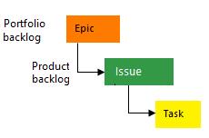

# ÉLÉMENTS DE TRAVAIL POUR UN PROJET SITE MARCHAND
## Comparaison des processus Agile Scrum, Basic et CMMI

---

## INTRODUCTION

### Objectif
- Comprendre les éléments de travail des 3 processus
- Appliquer ces processus à un projet site marchand
- Choisir l'approche adaptée à votre contexte

### Projet exemple : Site marchand
- Catalogue de produits
- Panier d'achat
- Paiement sécurisé
- Gestion des comptes utilisateurs
- Administration back-office

---

## 1. PRINCIPES AGILE GÉNÉRAUX

### Le Manifeste Agile (2001)
**4 valeurs fondamentales :**
- **Individus et interactions** > processus et outils
- **Logiciel fonctionnel** > documentation exhaustive
- **Collaboration avec le client** > négociation contractuelle
- **Adaptation au changement** > suivi d'un plan

### 12 Principes Agiles clés pour un site marchand
1. **Satisfaction client** : Livraison continue de logiciel de valeur
2. **Accueil du changement** : Même tard dans le développement
3. **Livraisons fréquentes** : De quelques semaines à quelques mois
4. **Collaboration quotidienne** : Entre équipe métier et développeurs
5. **Motivation** : Environnement et soutien pour les individus
6. **Communication face-à-face** : Méthode la plus efficace
7. **Logiciel fonctionnel** : Principale mesure d'avancement
8. **Rythme soutenable** : Développement durable
9. **Excellence technique** : Attention continue à la qualité
10. **Simplicité** : Art de maximiser la quantité de travail non fait
11. **Auto-organisation** : Meilleures architectures et conceptions
12. **Adaptation** : Ajustement régulier du comportement

### Méthodes Agiles populaires
- **Scrum** : Framework de gestion de projet (le plus utilisé)
- **Kanban** : Visualisation du flux de travail
- **XP (eXtreme Programming)** : Pratiques de développement
- **Lean** : Élimination du gaspillage
- **SAFe** : Agile à l'échelle de l'entreprise

### Application Agile au site marchand

**Exemple de cycle Agile :**
```
Semaine 1-2 : Développement fonctionnalité "Connexion utilisateur"
  |-- Jour 1-3 : Développement
  |-- Jour 4-5 : Tests et intégration
  |-- Jour 6-8 : Feedback client et ajustements
  |-- Jour 9-10 : Livraison et démonstration

Semaine 3-4 : Développement fonctionnalité "Catalogue produits"
  |-- Intégration des retours de la fonctionnalité précédente
  |-- Même cycle : développement → tests → feedback → livraison
```

**Bénéfices pour un e-commerce :**
- Adaptation rapide aux besoins du marché
- Feedback utilisateur intégré en continu
- Réduction des risques par livraisons fréquentes
- Amélioration continue de l'expérience utilisateur

---

## 2. PROCESSUS AGILE SCRUM

### Principes clés
- Livraison itérative et incrémentale
- Adaptation aux changements
- Collaboration étroite avec le client
- Auto-organisation de l'équipe

### Rôles essentiels
- **Product Owner** : Définit les priorités, gère le backlog
- **Scrum Master** : Facilite le processus, élimine les obstacles
- **Development Team** : Auto-organisée, pluridisciplinaire (3-9 personnes)

### Éléments de travail
- **Product Backlog** : Liste priorisée des fonctionnalités
- **User Story** : "En tant que [utilisateur], je veux [action] afin de [bénéfice]"
- **Sprint Backlog** : User stories sélectionnées pour le sprint
- **Incrément** : Fonctionnalités livrables en fin de sprint

### Exemple User Story - Site Marchand
```
US001 - Ajout au panier
En tant que client, je veux ajouter un produit à mon panier
afin de préparer ma commande.

Critères d'acceptation :
- Bouton "Ajouter au panier" visible sur chaque produit
- Confirmation visuelle après ajout
- Mise à jour du compteur panier
- Vérification du stock en temps réel

Estimation : 5 story points
```

### Cérémonies clés
- **Sprint Planning** : Sélection des user stories (2-4h)
- **Daily Scrum** : Synchronisation quotidienne (15 min)
- **Sprint Review** : Démonstration des fonctionnalités (1-2h)
- **Sprint Retrospective** : Amélioration continue (1-2h)

### Organisation des Sprints - Site Marchand
- **Sprint 1** : Authentification utilisateurs
- **Sprint 2** : Catalogue et recherche
- **Sprint 3** : Panier et commande
- **Sprint 4** : Paiement et facturation

---

## 3. PROCESSUS BASIC

### Principes clés
- Structure simple et intuitive
- Workflow linéaire avec états clairs
- Flexibilité dans l'organisation
- Documentation minimale mais suffisante

### Rôles essentiels
- **Product Owner** : Définit les priorités
- **Development Team Lead** : Organise le travail
- **Développeurs** : Implémentent les fonctionnalités
- **Testeur QA** : Valide la qualité

### Éléments de travail
- **Epic** : Grande fonctionnalité (ex: "Gestion des utilisateurs")
- **Feature** : Fonctionnalité spécifique (ex: "Inscription utilisateur")
- **User Story** : Besoin utilisateur concret
- **Task** : Tâche technique
- **Bug** : Défaut à corriger

### Exemple Work Items - Site Marchand
```
Epic E001 : Système de paiement
  |
  |-- Feature F001 : Intégration passerelle de paiement
  |     |
  |     |-- User Story US001 : Paiement par carte bancaire
  |     |     |
  |     |     |-- Task T001 : Configurer l'API de paiement
  |     |     |-- Task T002 : Créer le formulaire de carte
  |     |
  |     |-- Bug B001 : Erreur lors de transaction > 1000€
  |
  |-- Feature F002 : Gestion des factures
```

### États et workflow
- **New** → **Active** → **Resolved** → **Closed**
- Possibilité de revenir à **Active** si nécessaire

### Organisation par itérations
- **Itération 1** (2 semaines) : Authentification
- **Itération 2** (2 semaines) : Catalogue
- **Itération 3** (2 semaines) : Panier et commande
- **Itération 4** (2 semaines) : Paiement

---

## 4. PROCESSUS CMMI

### Principes clés
- Amélioration continue des processus
- Structure formelle et documentée
- Mesure et analyse quantitative
- Conformité aux standards

### Niveaux de maturité
- **Niveau 1 - Initial** : Processus imprévisibles
- **Niveau 2 - Géré** : Processus caractérisés par projet
- **Niveau 3 - Défini** : Processus organisationnels standards
- **Niveau 4 - Géré quantitativement** : Processus mesurés
- **Niveau 5 - Optimisé** : Amélioration continue

### Domaines de processus clés
- **PP** : Planification de projet
- **REQM** : Gestion des exigences
- **CM** : Gestion de configuration
- **VER** : Vérification
- **VAL** : Validation

### Éléments de travail CMMI - Site Marchand

**Niveau 2 - PP (Planification de Projet)**
```
Work Item : Analyse de portée site marchand
Description : Définir les fonctionnalités principales
Livrables :
- Document de portée projet
- Liste des fonctionnalités prioritaires
- Estimation des ressources
```

**Niveau 3 - REQM (Gestion des Exigences)**
```
Work Item : Matrice de traçabilité exigences
Description : Tracer les exigences jusqu'à l'implémentation
Livrables :
- Matrice de traçabilité complète
- Validation des exigences par les parties prenantes
```

### Métriques essentielles
- Densité de défauts (bugs/KLOC)
- Couverture de tests (>80%)
- Temps de réponse pages (<3s)
- Vélocité de développement

---

## COMPARAISON DES APPROCHES

### Complexité et mise en œuvre
- **Agile (général)** : Complexité variable selon la méthode
- **Agile Scrum** : Complexité moyenne, 2-4 semaines
- **Basic** : Complexité faible, 1-2 semaines
- **CMMI** : Complexité élevée, 3-12 mois

### Forces et faiblesses

**Agile (principes généraux)**
- ✅ Flexibilité et adaptation au changement
- ✅ Collaboration étroite avec le client
- ✅ Livraisons fréquentes de valeur
- ❌ Nécessite une culture organisationnelle adaptée
- ❌ Peut manquer de structure pour certains projets

**Agile Scrum**
- ✅ Adaptation rapide aux changements
- ✅ Livraison régulière de valeur
- ❌ Documentation limitée
- ❌ Dépendance aux personnes clés

**Basic**
- ✅ Simplicité de mise en œuvre
- ✅ Flexibilité organisationnelle
- ❌ Manque de structure pour gros projets
- ❌ Pas de mécanisme formel d'amélioration

**CMMI**
- ✅ Qualité et prévisibilité élevées
- ✅ Traçabilité complète
- ❌ Lourdeur administrative
- ❌ Coût et délai de mise en œuvre

### Recommandations par contexte

**Équipe débutante en Agile**
- Recommandation : **Principes Agile + Processus Basic**
- Raisons : Introduction progressive à l'agilité, simplicité

**Startup e-commerce**
- Recommandation : **Agile Scrum**
- Raisons : Adaptation rapide, time-to-market critique

**PME premier site marchand**
- Recommandation : **Processus Basic**
- Raisons : Simplicité, budget limité, équipe débutante

**Grande entreprise e-commerce critique**
- Recommandation : **CMMI**
- Raisons : Qualité critique, conformité réglementaire

---

## CONCLUSION

### Points clés à retenir
- Pas de processus universellement meilleur
- Adapter selon contexte, équipe et objectifs
- Possibilité d'hybridation des approches
- Évolution progressive vers plus de maturité

### Questions à se poser
1. Quelle est la taille et maturité de mon équipe ?
2. Quelles sont les contraintes réglementaires ?
3. Quelle est l'importance de la time-to-market ?
4. Quel niveau de qualité est requis ?

### Pour aller plus loin
- Documentation complète des trois processus
- Exemples détaillés pour chaque élément de travail
- Templates et outils adaptés à chaque approche

